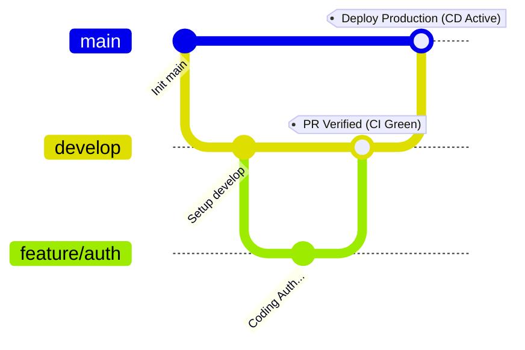

# 👚 V-Closet - Smart Wardrobe & AI Fashion Assistant

Welcome to **V-Closet**, a premium smart wardrobe management and AI-powered fashion assistant system. This project is built using **ASP.NET Core 8.0** and **PostgreSQL**, structured according to **Clean Architecture** patterns, fully containerized with **Docker**, and automated with **GitHub Actions CI/CD**.

---

## 🚀 Key Features & Highlights

*   **Clean Architecture Structure:** Independent layers ensuring core business logic is completely isolated from DB frameworks and presentation.
*   **PostgreSQL Native Enums:** Advanced type mapping configured with `NpgsqlDataSourceBuilder` for 10 core domain enums.
*   **Secure Secrets Management:** Powered by `.env` configurations and zero-credential `appsettings.json` to prevent secrets leakage.
*   **Docker Orchestration:** Quick boot local environment compiling API and database container dynamically.
*   **Git-Flow Automated CI/CD:** Continuous Integration (Build & Test) for feature and develop branches, with automated Deployment (CD) when merging to main.

---

## 🏛️ System Architecture

The codebase strictly follows Onion/Clean Architecture guidelines, divided into four projects:

```
VClosetSolution/
├── VCloset.Domain/         # Core Layer: Entities, CLR Enums, no external dependencies
├── VCloset.Application/    # Use Cases Layer: Service contracts, business logic rules
├── VCloset.Infrastructure/ # Data Access Layer: EF Core DbContext, DB Migrations, Npgsql setup
├── VCloset.API/            # Presentation Layer: Controllers, Swagger, Program.cs entry point
```

---

## 🛠️ Technology Stack

*   **Backend Framework:** ASP.NET Core Web API (v8.0)
*   **Database Engine:** PostgreSQL (v16)
*   **ORM Framework:** Entity Framework Core 8.x (PostgreSQL provider)
*   **Local Secrets:** `dotenv.net` integration
*   **Containerization:** Docker & Docker Compose
*   **Automation Pipelines:** GitHub Actions (dotnet runtime & Docker build)

---

## 🚀 Quick Start & Local Setup

Follow these simple steps to spin up the project locally:

### 1. Configure Local Secrets
Copy the example environment template file to create your own local secrets file:
```bash
cp .env.example .env
```
Open the `.env` file and verify your local PostgreSQL credentials:
```env
DB_HOST=localhost
DB_PORT=5432
DB_NAME=V-Closet_Version_3.0
DB_USER=postgres
DB_PASSWORD=devpassword
```

### 2. Method A: Run via Docker Compose (Recommended)
Launch the API and a fresh PostgreSQL database container instantly:
```bash
docker-compose up --build
```
Access the Swagger documentation at: **`http://localhost:5070/swagger/index.html`**

### 3. Method B: Run via .NET CLI
Make sure your local PostgreSQL database is running, then run:
```bash
dotnet restore
dotnet build
dotnet run --project VCloset.API
```

---

## 👥 Git-Flow & Branching Rules

Our team adheres to a strict Git-Flow workflow to ensure codebase stability:



1.  **`feature/*` / `hotfix/*` (Nhánh riêng):** Devs code features here. Pushing triggers **CI (Build & Test)** to verify code quality.
2.  **`develop` (Nhánh chung):** Combined working branch. Pushing/merging triggers **CI (Build & Test)** to ensure integration stability.
3.  **`main` (Nhánh Production):** Release branch. Merging into `main` automatically triggers the **CI/CD Pipeline** to compile, run tests, build the Docker production image, and deploy/push to registry.

---

## 📈 CI/CD Pipeline Status

The pipeline is orchestrated inside [`.github/workflows/dotnet-ci-cd.yml`](.github/workflows/dotnet-ci-cd.yml).
*   **Continuous Integration (CI):** Builds solution under `Release` configuration and executes tests across all active branches.
*   **Continuous Deployment (CD):** Packages and pushes production Docker images to registries only on successful merges to `main`.
