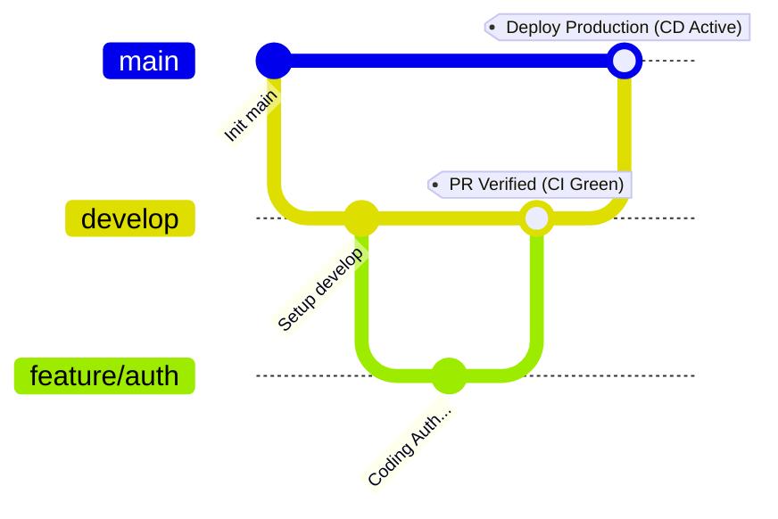

# 👚 V-Closet - Trợ Lý Thời Trang & Quản Lý Tủ Đồ Thông Minh

Chào mừng bạn đến với **V-Closet**, hệ thống quản lý tủ đồ và trợ lý thời trang cao cấp bằng AI. Dự án này được xây dựng bằng **ASP.NET Core 8.0** và **PostgreSQL**, cấu trúc theo mô hình **Clean Architecture**, được chứa (containerized) hoàn toàn bằng **Docker**, và tự động hóa với **GitHub Actions CI/CD**.

---

## 🚀 Tính Năng Chính & Điểm Nổi Bật

*   **Cấu Trúc Clean Architecture:** Các tầng độc lập đảm bảo logic nghiệp vụ cốt lõi hoàn toàn tách biệt khỏi các framework cơ sở dữ liệu và giao diện.
*   **PostgreSQL Native Enums:** Ánh xạ kiểu dữ liệu nâng cao được cấu hình với `NpgsqlDataSourceBuilder` cho 10 enums cốt lõi của ứng dụng.
*   **Quản Lý Bảo Mật Chặt Chẽ:** Sử dụng file `.env` và `appsettings.json` không chứa mật khẩu tĩnh để tránh rò rỉ thông tin nhạy cảm.
*   **Điều Phối Bằng Docker:** Khởi động nhanh môi trường cục bộ, tự động biên dịch API và container cơ sở dữ liệu.
*   **Tự Động Hóa CI/CD Theo Git-Flow:** Tích hợp liên tục (Build & Test) cho các nhánh feature/develop và Triển khai tự động (CD) khi gộp vào nhánh main.

---

## 🏛️ Kiến Trúc Hệ Thống & Hướng Dẫn Code

Mã nguồn tuân thủ nghiêm ngặt các nguyên tắc **Clean Architecture** (N-Tier). Dưới đây là phân tích chi tiết từng tầng và nơi bạn nên viết code:

### 1. `VCloset.Domain` (Tầng Cốt Lõi)
*   **Vai trò:** Là trái tim của ứng dụng, hoàn toàn độc lập với các framework hay công nghệ bên ngoài.
*   **Chứa:** Các Entities (các bảng Database được map thành class C#), Enums, và logic nghiệp vụ cơ bản.
*   **Khi nào code ở đây:** Khi bạn cần sửa đổi cấu trúc database (thêm/bớt bảng), thêm Enum mới, hoặc viết các quy tắc kiểm tra logic cơ bản gắn với entity.

### 2. `VCloset.Infrastructure` (Tầng Hạ Tầng & Dịch Vụ Ngoài)
*   **Vai trò:** Xử lý toàn bộ giao tiếp với "thế giới bên ngoài" (Databases, APIs, Caching, Email, Storage).
*   **Chứa:** Entity Framework Core `DbContext`, Repositories, các cấu hình Database, và tích hợp dịch vụ bên thứ 3.
*   **Khi nào code ở đây:** Khi cần viết Repositories cho các câu truy vấn DB phức tạp, cấu hình quan hệ EF Core (`OnModelCreating`), hoặc tích hợp dịch vụ như AWS S3, gửi Email.

### 3. `VCloset.Application` (Tầng Nghiệp Vụ) - ⚠️ VIẾT CODE CHÍNH Ở ĐÂY
*   **Vai trò:** Tầng quan trọng nhất chứa toàn bộ Logic Nghiệp Vụ và Use Cases của ứng dụng.
*   **Chứa:** DTOs (Data Transfer Objects), Services, và Interfaces.
*   **Khi nào code ở đây:** Bạn sẽ code ở đây nhiều nhất. Hãy tạo các thư mục như `DTOs/` (để chứa các model Request/Response), `Services/` (ví dụ: `WardrobeService.cs` chứa logic thêm đồ), và `Interfaces/` (định nghĩa các hàm cho Services và Repositories).

### 4. `VCloset.API` (Tầng Giao Diện)
*   **Vai trò:** Nơi tiếp nhận các Request HTTP/REST API và trả về Response.
*   **Chứa:** `Program.cs`, `appsettings.json`, và thư mục `Controllers/`.
*   **Khi nào code ở đây:** Khi bạn cần tạo một endpoint API mới. Hãy tạo một class mới trong `Controllers/` (ví dụ: `WardrobeController.cs`). Nhiệm vụ *duy nhất* của controller là nhận Request, truyền sang Service ở tầng Application, và trả về HTTP Response. **Tuyệt đối không viết logic tính toán phức tạp bên trong Controllers.**

### 🔄 Ví dụ Quy Trình Code Chuẩn:
Để làm chức năng "Lấy danh sách tủ đồ":
1.  **(Domain):** Sử dụng Entity `WardrobeItem` có sẵn.
2.  **(Application):** Tạo class `WardrobeItemDto`, định nghĩa `IWardrobeService`, và viết code lấy dữ liệu bên trong `WardrobeService`.
3.  **(API):** Tạo `WardrobeController` có chứa hàm `[HttpGet]`. Hàm này sẽ gọi `_wardrobeService.GetItemsAsync()` và trả về kết quả qua `Ok(result)`.

---

## 🛠️ Công Nghệ Sử Dụng

*   **Backend Framework:** ASP.NET Core Web API (v8.0)
*   **Database Engine:** PostgreSQL (v16)
*   **ORM Framework:** Entity Framework Core 8.x (PostgreSQL provider)
*   **Bảo Mật Local:** Tích hợp `dotenv.net`
*   **Container Hóa:** Docker & Docker Compose
*   **Tự Động Hóa:** GitHub Actions (dotnet runtime & Docker build)

---

## 🚀 Hướng Dẫn Cài Đặt Chạy Máy Cục Bộ

Làm theo các bước đơn giản sau để chạy dự án trên máy của bạn:

### 1. Cấu Hình Biến Môi Trường (Secrets)
Copy file mẫu cấu hình để tạo file biến môi trường của riêng bạn:
```bash
cp .env.example .env
```
Mở file `.env` và xác nhận lại tài khoản PostgreSQL của máy bạn:
```env
DB_HOST=localhost
DB_PORT=5432
DB_NAME=V-Closet_Version_3.0
DB_USER=postgres
DB_PASSWORD=mat_khau_cua_ban
```

### 2. Cách A: Chạy qua Docker Compose (Khuyên dùng)
Khởi động API và Database PostgreSQL mới tinh cùng lúc:
```bash
docker-compose up --build
```
Truy cập tài liệu API Swagger tại: **`http://localhost:5070/swagger/index.html`**

### 3. Cách B: Chạy qua .NET CLI
Đảm bảo rằng Database PostgreSQL trên máy bạn đang chạy, sau đó gõ lệnh:
```bash
dotnet restore
dotnet build
dotnet run --project VCloset.API
```

---

## 👥 Quy Tắc Code Theo Git-Flow & Chia Nhánh

Team áp dụng quy trình làm việc Git-Flow nghiêm ngặt để đảm bảo sự ổn định của dự án:



1.  **`feature/*` / `hotfix/*` (Nhánh Riêng):** Lập trình viên code tính năng mới ở đây. Khi Push sẽ kích hoạt **CI (Build & Test)** để kiểm tra chất lượng code.
2.  **`develop` (Nhánh Chung):** Nhánh làm việc tổng hợp. Khi Push hoặc Merge sẽ kích hoạt **CI (Build & Test)** để đảm bảo khi ghép code không bị lỗi.
3.  **`main` (Nhánh Production):** Nhánh chạy thực tế. Việc gộp code vào `main` sẽ tự tự động chạy **CI/CD Pipeline** để biên dịch, chạy test, build Docker image cho môi trường production và tự động đẩy lên registry.

---

## 📈 Tình Trạng Pipeline CI/CD

Toàn bộ quy trình tự động được thiết lập trong file [`.github/workflows/dotnet-ci-cd.yml`](.github/workflows/dotnet-ci-cd.yml).
*   **Continuous Integration (CI):** Tự động Build mã nguồn ở chế độ `Release` và chạy unit tests trên mọi nhánh đang hoạt động.
*   **Continuous Deployment (CD):** Đóng gói và đẩy Docker images lên registries dành cho production chỉ khi code được merge thành công vào nhánh `main`.
